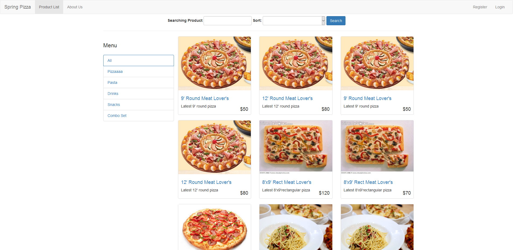

# Spring Pizza
This is a Pizza shop implemented using [Spring](https://spring.io/). UI framework using [Bootstrap](http://getbootstrap.com/).



# Requirement
JDK 8

# Setup
1. Just clone the source

2. Import the shop.sql to relational database(mysql, postgresql, etc...) *(Use phpMyAdmin or whatever you like)*

3. Set the required environment variable: DB_URL, DB_USERNAME, DB_PASSWORD, etc... (See: [Properties file](src/main/resources/application.properties)

```
export DB_URL=jdbc:mysql://localhost:3306/pizza
export DB_USERNAME=??
export DB_PASSWORD=??
```

4. Start the server by gradle

```
gradle bootRun
```

5. Enjoy!

## License
MIT
